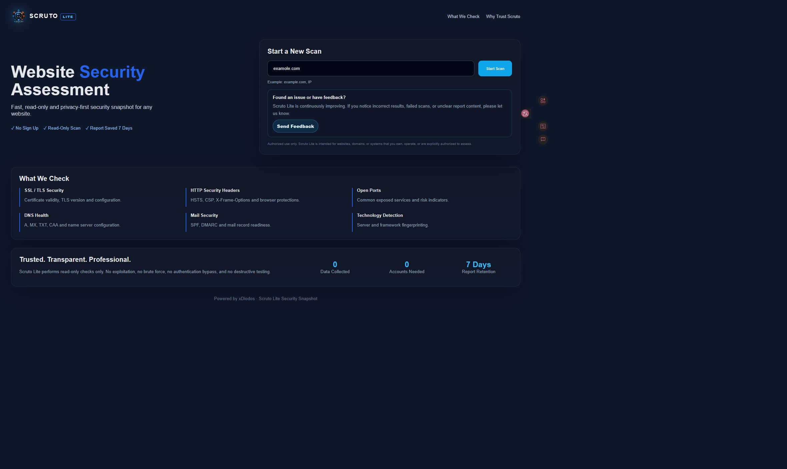
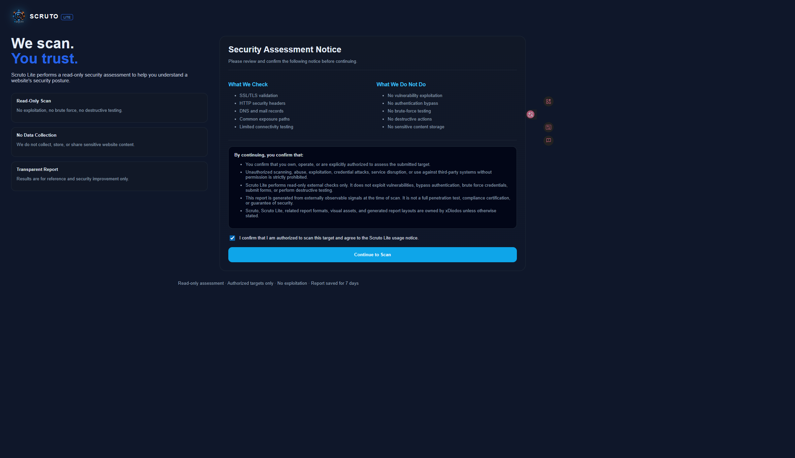
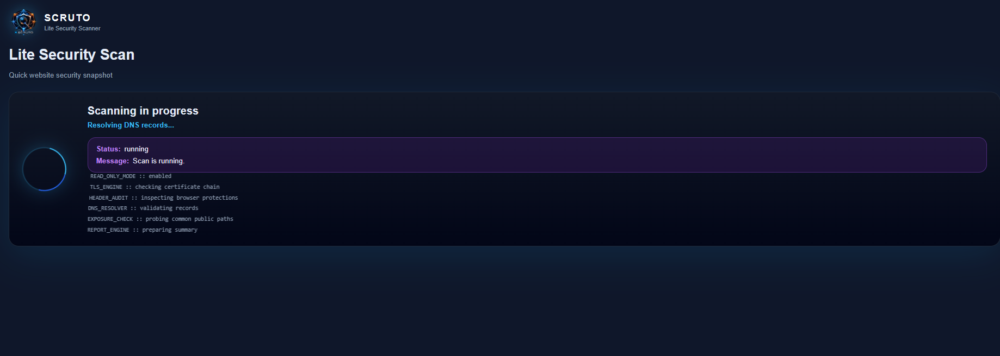
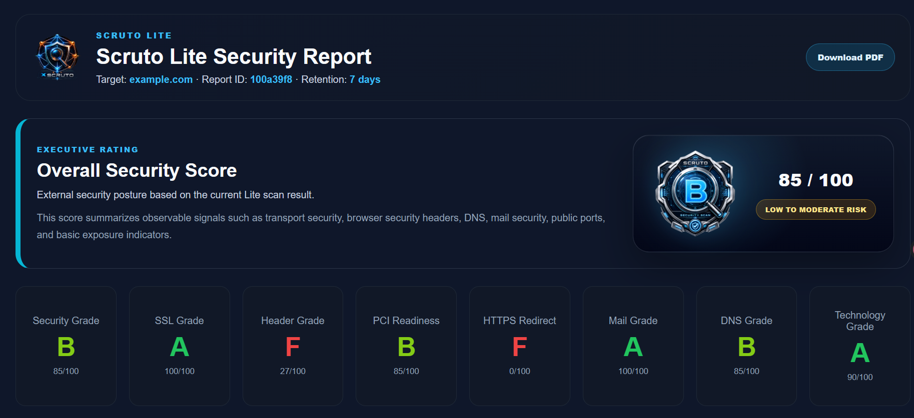
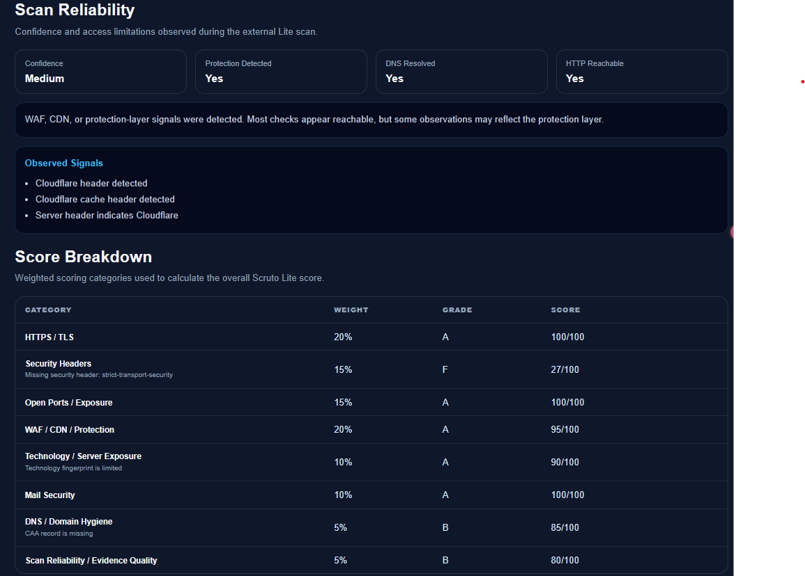
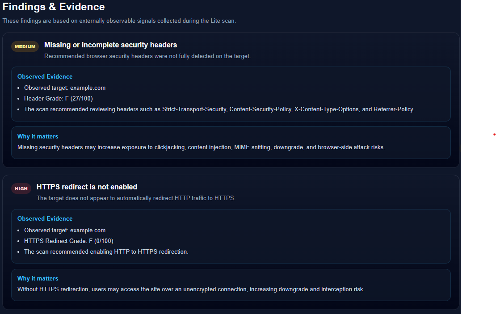
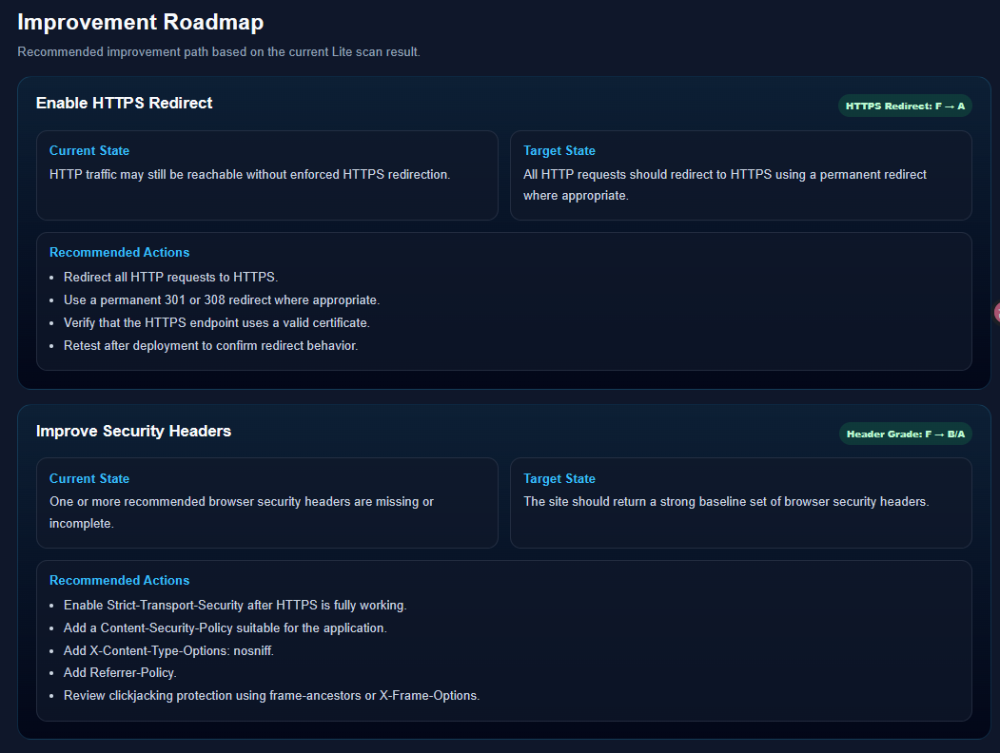
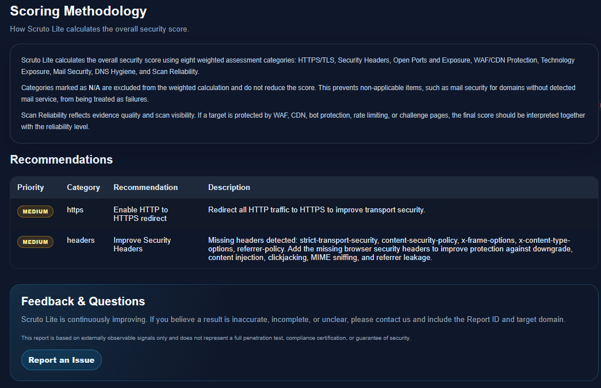

# Scruto Lite Showcase

Scruto Lite is a lightweight security assessment and reporting experience designed for basic website exposure review, readable security reporting, and early-stage security awareness.

This repository is a public showcase repository.

It provides:

- Product overview
- Usage flow
- Screenshots
- Sample reports
- Public documentation
- Roadmap
- Usage disclaimer

This repository does not include:

- Source code
- Scanner engine logic
- Backend implementation
- Deployment scripts
- Infrastructure configuration
- Internal abuse-prevention logic
- Private operational details

## Status

Scruto Lite currently includes:

- Landing Page
- Consent Page
- Scan Policy validation
- Web Report
- PDF Report
- Grade Badge
- Weighted scoring
- Mail N/A handling
- Recommendation aggregation
- Feedback Channel

## Contact

For product questions, feedback, or report-related inquiries:

support@xdiodos.com

## License

All rights reserved. See [LICENSE](LICENSE).

## Visual Assets

Public showcase assets are available under:

```text
assets/logo/
assets/badges/

The logo and grade badge images are provided for product demonstration and documentation purposes only.

All rights reserved by xDiodos / OSSIP Lab.

## Product Screenshots

### Landing Page



### Consent Page



### Scan Progress



### Web Report Summary



### Scan Reliability and Score Breakdown



### Findings and Evidence



### Improvement Roadmap



### Recommendations and Feedback


