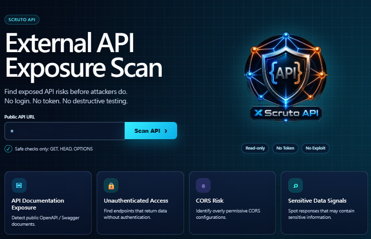
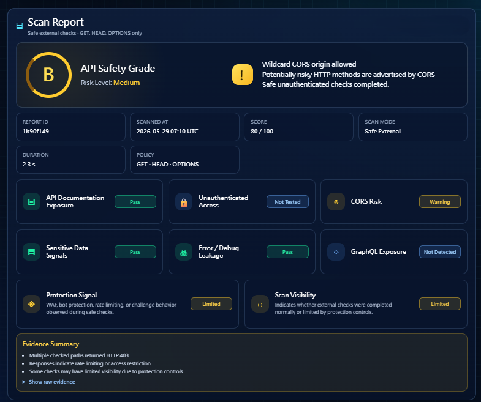
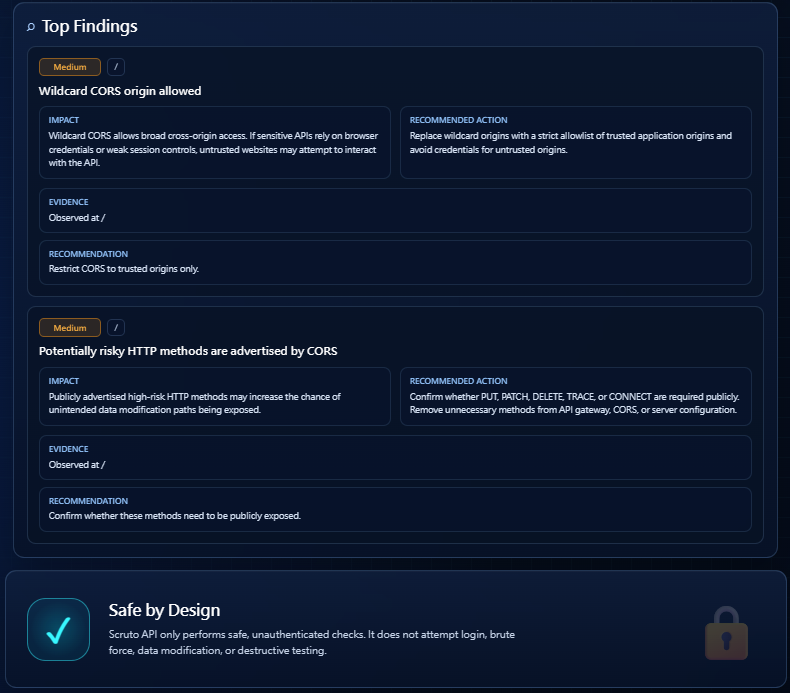

# Scruto API Early Preview

Scruto API is an early preview feature in the Scruto product line.

It provides safe external API exposure checks for publicly reachable API endpoints.

## Purpose

Scruto API helps website owners, developers, and security teams identify externally visible API risk signals before they become serious security issues.

Scruto API is not a penetration testing tool.  
It is a safe external exposure review tool.

## Current Checks

Scruto API currently checks for:

- Public API documentation exposure
- CORS risk signals
- GraphQL exposure signals
- Sensitive data indicators
- Error and debug leakage
- Protection Signal / Scan Visibility

## Report Output

Each scan may include:

- API Safety Grade
- Risk level
- Score
- Finding detail
- Impact
- Recommended action
- Evidence summary
- Protection Signal
- Scan Visibility
- Report ID
- JSON report

## Safety Policy

Scruto API does not perform:

- Login attempts
- Token testing
- Brute force
- Exploitation
- Authentication bypass
- Payload fuzzing
- Data modification
- Destructive testing

Scruto API only uses safe, unauthenticated, read-only checks:

- GET
- HEAD
- OPTIONS

## Current Status

Scruto API is currently available as an early public preview.

Preview URL:

https://scruto.xdiodos.com/scruto-api

## Screenshots

### 1. Scruto API Landing

### 2. Usage Notice

### 3. API Scan Report

